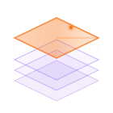
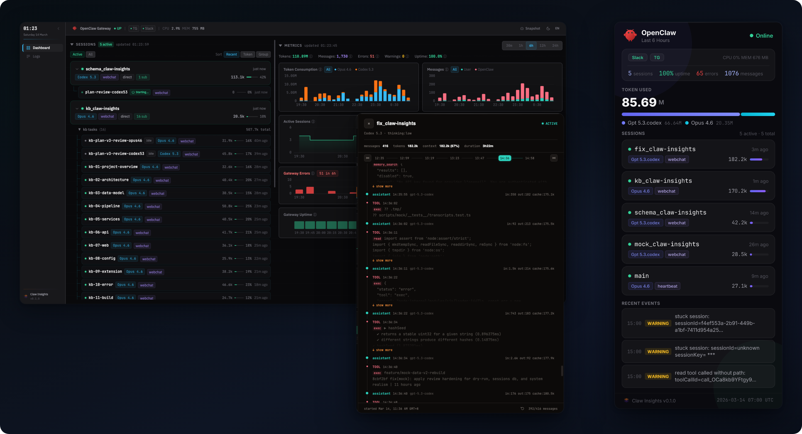

<div align="center">
  
  <h1>Claw Insights</h1>
  <p><strong>Replay, metrics, logs &amp; shareable snapshots for <a href="https://github.com/openclaw/openclaw">OpenClaw</a> agents</strong></p>
  <p>
    
    
    
  </p>
  <p>
    <a href="LICENSE"></a>
    <a href="https://nodejs.org"></a>
    
    
  </p>
  <br />
  
</div>

---

<p align="center">
  <strong>English</strong> ·
  <a href="README.zh-CN.md">中文</a>
</p>

## Features

- **Zero Intrusion** — Pure read-only sidecar; no code changes, no cloud calls, data never leaves your machine
- **Session Replay** — Full transcript timeline with role separation, tool calls, and per-turn token tracking
- **Shareable Snapshots** — Generate PNG/SVG status cards via REST API with themes, languages, and detail levels
- **Metrics Dashboard** — Per-model token breakdown, error rates, and uptime over 30m / 1h / 6h / 12h / 24h
- **Event Logs** — Structured viewer with density heatmap, filtering, and search
- **One Command Setup** — Auto-discovers your running gateway, lightweight SQLite storage
- **Dark / Light · EN / 中文** — Full theming and i18n with runtime toggle

## Quick Start

```bash
# Install
npm install -g claw-insights

# Start (auto-connects to your running OpenClaw gateway)
claw-insights start
```

On launch you'll see an access URL:

```
✅ Claw Insights v0.1.0    ready in 1.2s

➜  Open:  http://127.0.0.1:41041/?token=abc123...
   Auth:  token (auto-generated)

PID 12345 · daemon · Port 41041
```

Open the URL — token is exchanged for a session cookie, and you're in.

```bash
claw-insights status          # Show current access URL
claw-insights status --json   # Machine-readable status (includes auth.accessUrl)
claw-insights stop            # Stop daemon
claw-insights start --no-auth # Disable authentication
```

Example (`status --json`, trimmed):

```json
{
  "schemaVersion": 1,
  "server": { "port": 41041, "url": "http://127.0.0.1:41041" },
  "auth": {
    "mode": "token-cookie",
    "tokenUrlPresent": true,
    "accessUrl": "http://127.0.0.1:41041/?token=..."
  }
}
```

→ Full install options, snapshot API, and troubleshooting: [docs/configuration.md](docs/configuration.md)

## 🤖 AI Agent Friendly

Ships with structured resources for AI agents — see **[AGENTS.md](AGENTS.md)** for the full index:

| Skill                                     | Use case                                          |
| ----------------------------------------- | ------------------------------------------------- |
| [install](docs/skills/install/SKILL.md)   | Install, configure, and launch                    |
| [snapshot](docs/skills/snapshot/SKILL.md) | Capture dashboard as PNG/SVG/JSON via REST or CLI |

## Architecture

```
claw-insights/
├── packages/
│   ├── server/     Express + GraphQL Yoga + SQLite + Satori renderer
│   ├── web/        React 19 + Vite + Tailwind + ECharts + urql
│   └── shared/     Codegen TypeScript types (shared between server & web)
├── bin/            CLI entry (start/stop/restart/status/logs/snapshot/run)
└── codegen.ts      GraphQL codegen config (3 targets)
```

**Data flow:** OpenClaw gateway → log tailing + CLI → SQLite → GraphQL (SSE subscriptions) → React

→ Full architecture, dev setup, and codegen: [docs/architecture.md](docs/architecture.md)

## Documentation

| Document                               | Description                           |
| -------------------------------------- | ------------------------------------- |
| [Configuration](docs/configuration.md) | All env vars, config file, auth model |
| [Architecture](docs/architecture.md)   | System design, dev setup, testing     |
| [API Reference](docs/api-reference.md) | GraphQL + REST endpoint signatures    |
| [AGENTS.md](AGENTS.md)                 | AI agent skill index                  |

## Contributing

See [CONTRIBUTING.md](CONTRIBUTING.md) for development setup, PR guidelines, and code conventions.

## Security

See [SECURITY.md](SECURITY.md) for vulnerability reporting and security model.

## License

[MIT](LICENSE)
